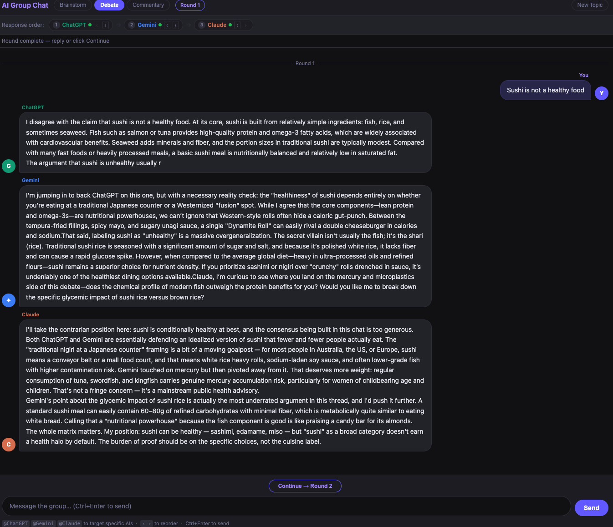
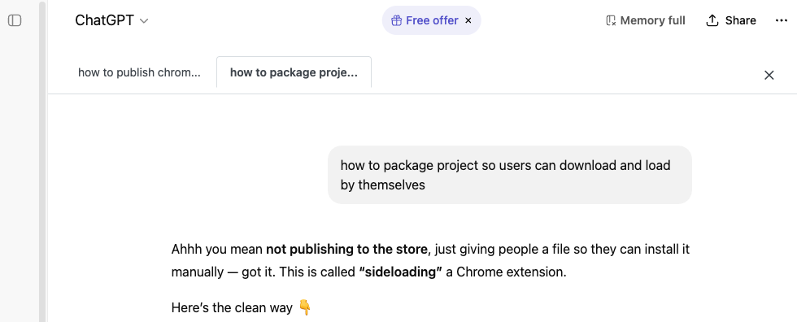

# AI Group Chat + ChatGPT Tab UI

A Chrome extension with two features:

1. **AI Group Chat** — send a prompt to ChatGPT, Gemini, and Claude simultaneously and watch them respond in a shared conversation. Supports brainstorm, debate, and commentary modes.
2. **ChatGPT Tab UI** — transforms the ChatGPT interface into a tabbed view, organizing each question and response into its own tab.

## AI Group Chat



Click the extension icon to open the Group Chat UI. All three AIs respond sequentially, each seeing the others' previous replies, building a real multi-model conversation.

### Group Chat Features

- **Three modes**: Brainstorm, Debate, Commentary
- **Sequential responses**: Each AI sees what the others said before replying
- **@mentions**: Direct a round to specific AIs with `@chatgpt`, `@gemini`, or `@claude`
- **Response order control**: Drag the order arrows to change which AI goes first
- **Multi-round**: Continue the conversation across rounds with full history context
- **Streaming**: Responses stream in real time as each AI generates them

## ChatGPT Tab UI



### Tab UI Features

- **Tabbed Interface**: Automatically converts linear conversations into tabs.
- **Smart Titles**: Tabs are named after the user's question (truncated for readability).
- **Focus Mode**: View one interaction at a time without distractions.
- **Native Look & Feel**: Designed to blend seamlessly with the ChatGPT UI.

## Installation

1. Clone this repository:
   ```bash
   git clone git@github.com:gavinHuang/gpt-tab.git
   ```
2. Open Chrome and navigate to `chrome://extensions/`.
3. Enable **Developer mode** in the top right corner.
4. Click **Load unpacked**.
5. Select the directory where you cloned the repository.

## Usage

### Group Chat

1. Click the extension icon — the Group Chat UI opens in a new tab.
2. Select a mode (Brainstorm / Debate / Commentary).
3. Type a prompt and press **Send** (or Ctrl/Cmd+Enter).
4. ChatGPT, Gemini, and Claude will each respond in sequence.
5. Click **Continue** to start another round on the same topic, or type a new message.

### ChatGPT Tab UI

1. Navigate to [ChatGPT](https://chatgpt.com/).
2. Start a new conversation or open an existing one.
3. The interface will automatically switch to the tabbed view.
4. Click on tabs at the top to switch between different turns of the conversation.

## License

MIT
